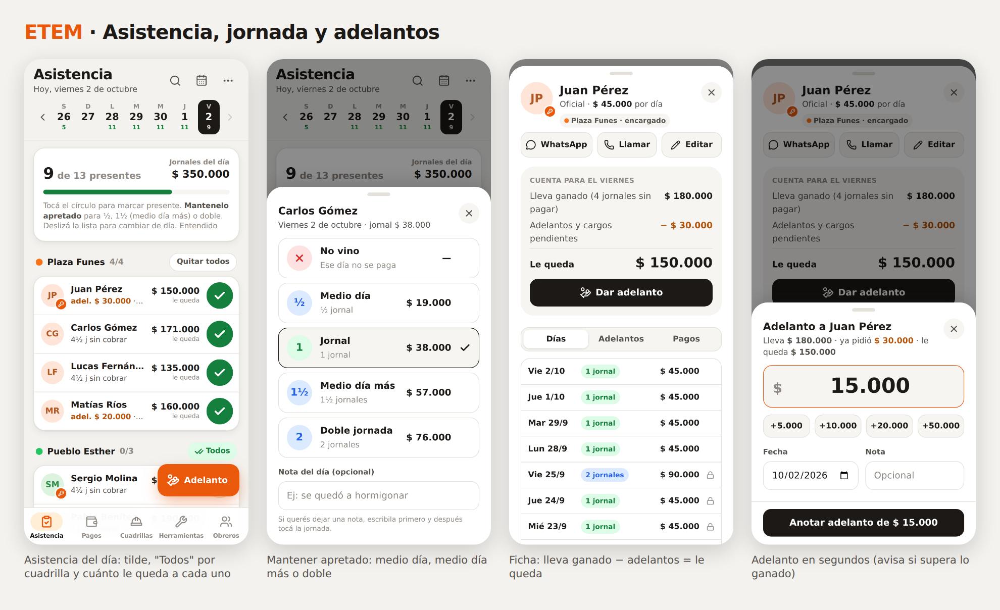
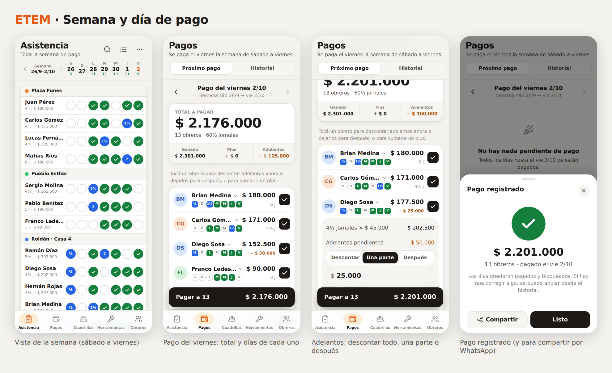
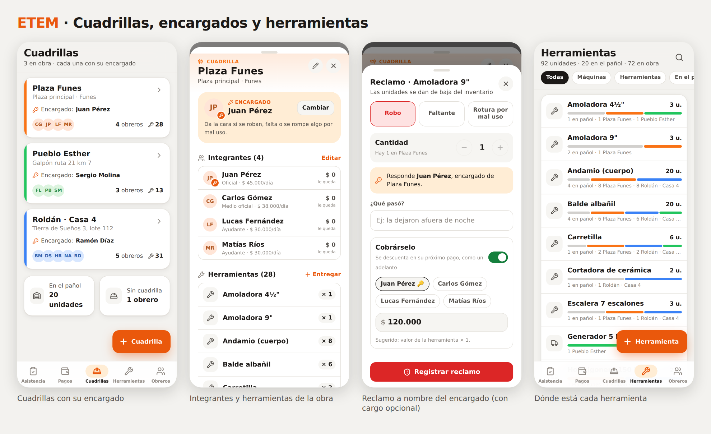

# Fluxa / ETEM — Obras desde el celular

App para reemplazar el cuaderno de obra: **asistencia** con un tilde, **pagos del viernes**
con descuento de **adelantos**, **cuadrillas** con su **encargado** y el **reparto de
herramientas** con sus reclamos. Pensada primero para el celular (se instala como app).

El diseño completo (patrones de uso, flujos, reglas de pago y modelo de datos) está en
**[docs/DISENO.md](docs/DISENO.md)**.





---

## Qué hace

| Sección | Para qué |
|---|---|
| **Asistencia** | Lista general del día (no por obra), agrupada por cuadrilla. Un toque = presente; mantener apretado = ½, 1½ (medio día más) o doble. "Todos" por cuadrilla. En cada fila: adelantos y **cuánto le queda** cobrar. Vista semanal. Funciona sin señal. |
| **Pagos** | Semana de **sábado a viernes**, se paga el viernes. Total a pagar, días de cada uno, descontar adelantos **todo / una parte / después**, plus, excluir a alguien. Confirmar, compartir por WhatsApp, recibos, historial y anular. |
| **Cuadrillas** | Cada obra con sus integrantes y un **encargado** que responde por las herramientas. Entregar del pañol, devolver, mover entre obras, reclamos e historial. |
| **Herramientas** | Inventario de herramientas y máquinas, dónde está cada unidad y quién responde. Reclamo por **robo, faltante o rotura** con opción de **cobrárselo** al responsable. |
| **Obreros** | Nombre, rol (capataz, oficial, medio oficial, ayudante), **jornal por día**, cuadrilla y teléfono. Ficha con su cuenta, adelantos y pagos. |

## Tecnología

- **Frontend** (`/frontend`): React 19, Vite, Tailwind CSS 4, Motion (animaciones), Lucide (íconos). PWA instalable.
- **Backend** (`/backend`): Node.js + Express 5, MySQL 8 (`mysql2`), JWT + bcrypt, Zod.

```
backend/
  server.js            rutas y manejo de errores
  auth.js              login, sesión (30 días) y cambio de contraseña
  db.js                conexión y transacciones
  lib/                 fechas, cálculos de pago (con tests), cuentas
  routes/              estado, obreros, cuadrillas, asistencia, adelantos, pagos, herramientas
  scripts/initDB.js    crea/actualiza la base (se corre en cada arranque)
  scripts/seed.js      datos de ejemplo (sólo para probar)
frontend/src/
  lib/                 api, estado global, cola sin señal, fechas y formatos
  ui/                  piezas: hojas deslizables, tilde, avisos, campos
  shell/               login, barra de secciones, menú
  secciones/           asistencia, pagos, cuadrillas, herramientas, obreros
```

---

## Levantarlo con Docker (recomendado)

1. `cp .env.example .env` y completá `DB_PASSWORD`, `JWT_SECRET` y `ADMIN_PASSWORD`.
2. `docker compose up --build -d`
3. Abrí `http://<ip-del-servidor>` y entrá con **admin** y la contraseña de `ADMIN_PASSWORD`.
4. En el celular: menú del navegador → **Instalar app** / **Agregar a inicio**.

## Desarrollo local (sin Docker)

Necesitás Node.js 20.19+ (o 22) y MySQL 8 o MariaDB (por ejemplo, la de XAMPP).

```bash
# Backend
cd backend
npm install
cat > .env <<'EOF'
PORT=3001
DB_HOST=localhost
DB_USER=root
DB_PASSWORD=
DB_NAME=etem_management
JWT_SECRET=algo-largo-y-random
ADMIN_PASSWORD=una-clave
EOF
npm run db:init        # crea la base y el usuario admin
npm run db:seed        # (opcional) carga datos de ejemplo si la base está vacía
npm run dev

# Frontend (otra terminal)
cd frontend
npm install
npm run dev            # http://localhost:5173 (le pasa /api al backend en :3001)
```

Si el backend corre en otro puerto: `VITE_API_PROXY=http://localhost:3003 npm run dev`.

## Pruebas

```bash
cd backend && npm test      # reglas de pago, adelantos y semanas de pago
cd frontend && npm run lint && npm run build
```

---

## Si venías usando la versión anterior

Al arrancar, `initDB` **no borra nada**: renombra las tablas viejas que ya no se usan
(`proyectos`, `trabajadores`, `asignaciones`, `asistencias` por obra, `ingresos_obra`,
`gastos_proveedor`, `comprobantes`) a `legacy_*`, y copia los trabajadores a la tabla nueva
`obreros` con su último jornal. La asistencia vieja no se copia (aparecería como deuda).

Cuando ya no las necesites, las podés borrar:

```sql
DROP TABLE legacy_comprobantes, legacy_ingresos_obra, legacy_gastos_proveedor,
           legacy_asistencias, legacy_asignaciones, legacy_proyectos, legacy_trabajadores;
```

## Licencia

ISC.
